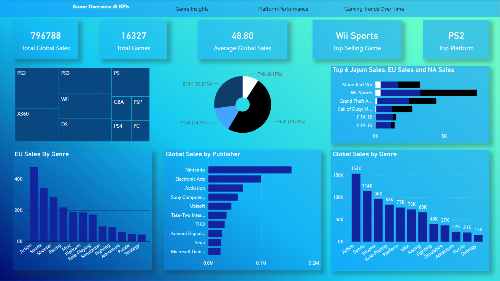
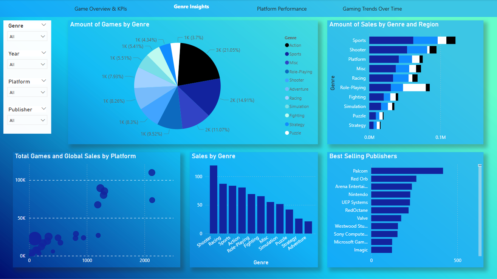
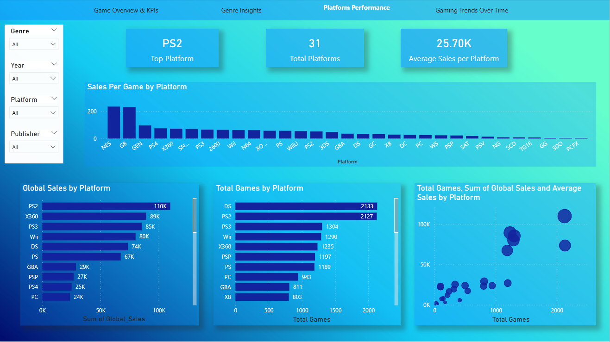
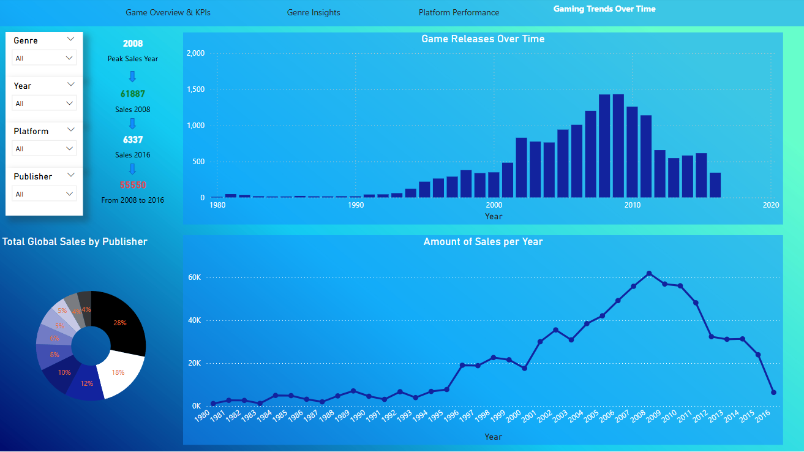

#  Video Game Sales Analysis Dashboard (Power BI)

This Power BI report provides an in-depth analysis of global video game sales data. It explores trends by genre, platform, publisher, and over time, offering key insights for stakeholders in the gaming industry.

---

##  Dataset

- **Columns include:**  
  `Rank`, `Name`, `Platform`, `Year`, `Genre`, `Publisher`,  
  `NA_Sales`, `EU_Sales`, `JP_Sales`, `Other_Sales`, `Global_Sales`

---

##  Page 1: Game Overview & KPIs

This page provides a top-level overview of the dataset through key performance indicators and high-level charts.

### Key Metrics:
- **Total Global Sales:** 796,788 units
- **Total Games:** 16,327
- **Average Global Sales per Game:** 48.80
- **Top Selling Game:** Wii Sports
- **Top Platform:** PS2

### Visuals:
- **Treemap:** Top platforms by sales
- **Donut Chart:** Sales distribution of top-selling games
- **Bar Chart:** Top-selling games in JP, EU, and NA
- **Bar Chart:** EU Sales by Genre
- **Bar Chart:** Global Sales by Publisher
- **Bar Chart:** Global Sales by Genre

---

##  Page 2: Genre Insights

This page dives into genre-based analysis to explore how different genres perform across regions and publishers.

### Highlights:
- **Pie Chart:** Distribution of games by genre
- **Bar Chart:** Sales by genre across different regions (NA, EU, JP, Other)
- **Bubble Chart:** Relationship between global sales and number of games per platform
- **Bar Chart:** Total sales by genre
- **Bar Chart:** Top publishers by number of games sold

### Filters Available:
- Genre, Year, Platform, Publisher

---

##  Page 3: Platform Performance

A breakdown of video game sales and distribution by platform.

### Key Metrics:
- **Top Platform:** PS2
- **Total Platforms Analyzed:** 31
- **Average Sales per Platform:** 25.70K

### Visuals:
- **Bar Chart:** Sales per game by platform
- **Bar Chart:** Global sales by platform
- **Bar Chart:** Total games by platform
- **Bubble Chart:** Total games vs global and average sales per platform

### Filters Available:
- Genre, Year, Platform, Publisher

---

##  Page 4: Gaming Trends Over Time

This page analyzes how game development and sales have evolved year by year.

### Highlights:
- **Peak Sales Year:** 2008  
  - Sales: 61,887 units  
  - Compared to 6,337 in 2016
- **Bar Chart:** Game releases over time (1980–2020)
- **Line Chart:** Total sales per year
- **Donut Chart:** Total global sales by publisher

### Filters Available:
- Genre, Year, Platform, Publisher

---

##  Technologies Used

- Power BI Desktop  
- DAX for KPI calculations and advanced metrics  
- Interactive slicers and page navigation for dynamic exploration

---

##  Insights Gained

- Action games dominate global sales
- Nintendo is the top-performing publisher globally
- Sales peaked around 2008 and have declined steadily since

---

##  How to Use

1. Open the `.pbix` file in Power BI Desktop
2. Use the slicers to filter by genre, platform, year, or publisher
3. Navigate between pages using the navigation bar at the top

---

## 🗂️ Repository Contents

- `/assets/` – Screenshots of the report pages  
- `VideoGameSales.pbix` – Power BI report file  
- `README.md` – This file  

---

